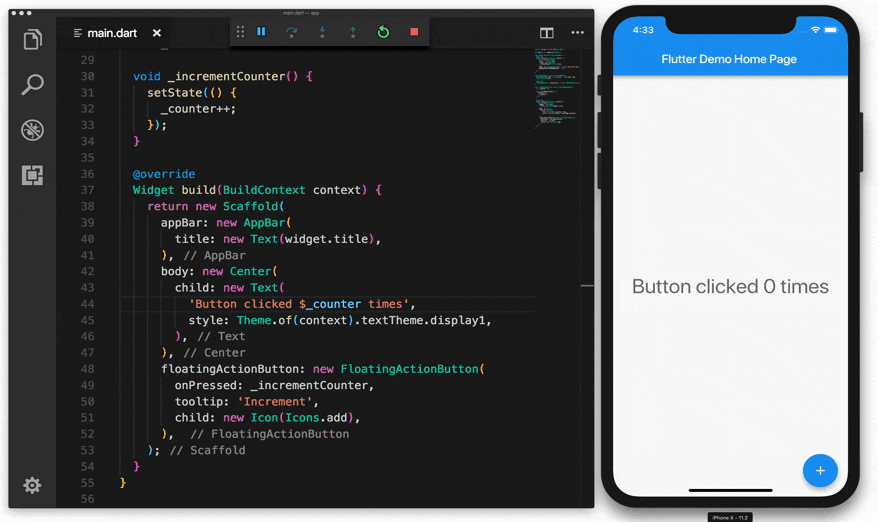
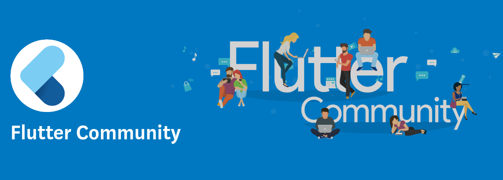

Mungkin kita sering mendengar kata **Flutter** tapi kita belum tahu **apa sih itu Flutter?** Mungkin juga banyak orang yang sudah tahu tentang teknologi Flutter ini, tapi tidak sedikit juga orang yang masih belum tahu tentang teknologi ini. Baik kali ini Saya akan memperkenalkan dengan teman-teman apa itu Flutter? sebelum lanjut ke alasan-alasan saya pakai Flutter.

### Apa sih itu Flutter?
Flutter yaitu sebuah framework mobile SDK(Software Development Kit) yang ditujukan untuk development app untuk cross-platform (bisa dijalankan di berbagai device), Flutter ini dikembangkan dan dirilis oleh Google, dan Flutter dibuat dengan bahasa **Dart**, mungkin sebagian teman-teman sudah mengenal tentang teknologi framewrok yaitu React Native, Xamarin, dll. Nah FLutter ini fungsinya mirip-mirip lah dengan React Native. Tapi Flutter ini lebih unggul dari pada framework mobile lainya, untuk lebih lanjut mari simak materi selanjutnya.

Mari kita bahas kenapa kita mesti pakai Flutter ini untuk mengembangkan sebuah aplikasi kita.

## Alasan Kenapa Pakai Flutter

### 1. Flutter di support oleh Google
Karena Flutter ini dibuat dan dikembangkan oleh Google pastilah akan di support langsung oleh Google, dan tidak hanya itu sering ketika apapun teknologi yang dibuat oleh Google itu akan bisa lebih tahan lama dan bisa berkembang dengan pesat, misal saja Android telah yang dibuat oleh Google sudah cukup lama dan dukungan update dan dokumentasinya selalu diupdate dan berpotensi juga untuk sebagai peluang kerja tinggi.

### 2. Pengembangan Aplikasi Cepat
Kenapa sih Flutter ini membuat pengembangan aplikasi kita jadi cepat?

Karena Flutter ini salah satu framework yang jenisnya hybrid atau juga dikenal dengan cross-platform yaitu kita bisa membuat sebuah aplikasi cuma dengan satu kali proses development(pengembangan) dan bisa untuk semua device(Android, IOS, MacOs, Linux, Windows, Web). Apa Flutter bisa support di platform device semua itu Android, IOS, Desktop, Web? 

Jawabannya yaitu Iya, tapi saat ini pada saat menulis blog ini Flutter hanya merilis versi stable untuk versi mobile(Android & IOS). Sedangkan untuk di Web versi masih pada versi Beta, dan jika ingin mencoba bisa kunjungi https://flutter.dev/web. Dan untuk yang versi dekstop (Mac Os, Linux, Windows) masih pada versi Alpha bisa teman-teman cek cuga di https://flutter.dev/desktop. Tidak hanya itu Flutter juga support di platform seperti Raspberry Pi. 

Nah dari sekian banyak platform yang disupport oleh Flutter, inilah yang menjadi banyak startup, dan developer ingin menggunakan Flutter sebagai pengembangan aplikasi mereka karena kepraktisannya.

### 3. Custom UI(User Interface) dan Animasi yang keren

Flutter ini dibuat dengan bahasa pemrograman Dart yang salah satu tujuannya yaitu untuk membuat sebuah User Interface/tampilan sebuah aplikasi kita lebih menarik dan interaktif. Di Flutter ini untuk membuat sebuah tampilan yang keren dan animasi yang keren itu tidaklah sulit, kita mudah sekali membuat dan mengedit/custom sebuah komponen User Interface atau di Flutter disebut dengan Widget itu sangat mudah. Dan di Flutter sudah banyak sekali Animasi bawaan yang sudah disediakan bisa tinggal kustomisasi atau pun membuat sebuah animasi baru dengan penggabungan dari Animasi bawan Flutter.

### 4. Performa Native

Ya, Flutter ini dirancang untuk build sebuah aplikasi build langsung ke native platform langsung, tidak seperti framework lainya seperti React Native, Xamarin, Open Gaps, yang dibuild ke web (html, css, js) dulu baru ke native. Disisi ini lah Flutter lebih unggul dari berbagai framework lainya. Dan tidak heran juga sebuah aplikasi yang dibuat dengan Flutter performanya bagus, karena dibuild langsung ke native / engine sebuah platform tertentu.

### 5. Tersedia Hot Reload

Nah fitur ini yang sangat saya sukai di Flutter, jika Anda pernah belajar/mengerjakan sebuah aplikasi native seperti Android di Android Studio dan IOS di XCode, bila kita ingin melihat perubaham yang kita ubah kita harus membuild ulang atau running ulang, di Flutter semua itu tidak di wajibkan lagi, kita bisa melihat langsung hasil perubahan kita setelah mensave/menyimpan file dan langsung dengan delay yang sangat cepat.

### 6. Sudah digunakan banyak di Startup dan Perusahaan besar dunia

Seperti yang saya lihat di showcase Flutter https://flutter.dev/showcase banyak sekali perusahaan dan startup bersar yang sudah memakai Flutter ini untuk mengembankan dan membuat sebuah aplikasi keren mereka, seperti Google, Alibaba, Square, Tencent, Grab, dan masih banyak lagi.

### 7. Berpotensi Populer

Bagaimana tidak, saat ini developer flutter saja sudah banyak sekali, dan juga komunitasnya juga yang dibangun untuk meninggkatkan para developer baru Flutter, dan saat ini Flutter di github 91.5K dan issue lebih dari 5000, itu menandakan banyaknya peminat Flutter saat ini. Dengan banyaknya peminat Flutter maka flutter dengan sendirinya akan sangat populer, dan dengan diiringi lowongan kerja dan perusahaan dan statup ingin berpindah/menggunakan flutter ini, yang bisa menambah banyaknya lowongan kerja sebagai Flutter developer.

### 8. Mudah mencoba belajar
Di Flutter sudah menyediakan playground editor secara online yang memungkinkan kita mencoba dan belajar bahkan membuat aplikasi secara online tanpa kita membutuhkan install apapun(kecuali browser) hehe. Saat ini Flutter menyediakan dua platform yaitu [DartPad](http://dartpad.dev/) dan [CodePen](https://codepen.io/flutter). Untuk DartPad bisa digunakan untuk pemrograman Dart dan Flutter, jadi bisa belajar dulu bahasa pemrograman Dart dulu sebelum mencoba Flutter.

---

Dari sekian banyak kelebihan Flutter saat ini apa sih kekurangan dari Flutter tersebut?

Dari pengalaman saya saat ini sih saya cuma menemukan masalah di Flutter yaitu ukuran aplikasi lebih besar daripada native, tapi itu sih masih wajar kalau aplikasi tersebut dibuat dengan hybrid teknologi, dan bisa di minimalisir dengan berbagai cara bisa di lihat di https://flutter.dev/docs/deployment/android. 

Berikut sedikit pengalaman saya setelah memakai Flutter sampai saat ini.  

Teman-teman bisa follow saya di twitter:

https://twitter.com/wisnuwiry

Akhir kata, Salam Hello World